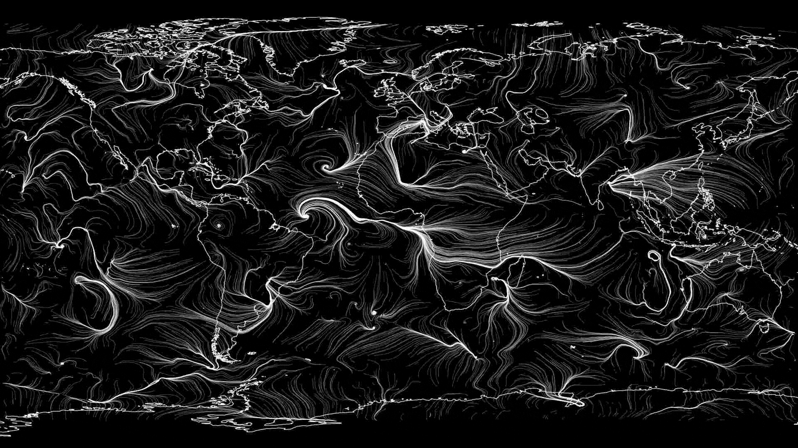

# wind
let current wind dance as moving streamlines on desktop background

## 1. download & decode wind data

the lua script `wind_decode.lua` downloads recent wind as `json` from
noaa (not yet), imports and decodes it and write to `csv`, to be
analysed by octave script `wind_thread.m`.

> lua wind_decode.lua

## 2. calculate streamlines

the octave script `wind_thread.m` imports recent wind data from
`wind.csv` generated in (1), calculates some 10k streamlines from
random positions and saves them, seperated by "0 0" lines, as
`streamlines.dat` to be read by conkys lua script (3).

> octave wind_thread.m

## 3. draw

the lua script `wind_weave.lua` imports the streamlines from
`streamlines.dat`, and draws them using `conkys` `cairo` backend via
`wind_blow.lua`. This script is run automatically by (4), but has to
be changed to adjust opacity, linecolor, etc.

## 4. start conky

conky config script to load lua script wind_weave.lua, which prints
the wind streamlines in streamlines.dat:

> conky -c ~/wind/wind_blow.lua

## todo
- shell script: (1) and (2) need to be run once every time the noaa
  updates the wind data.
